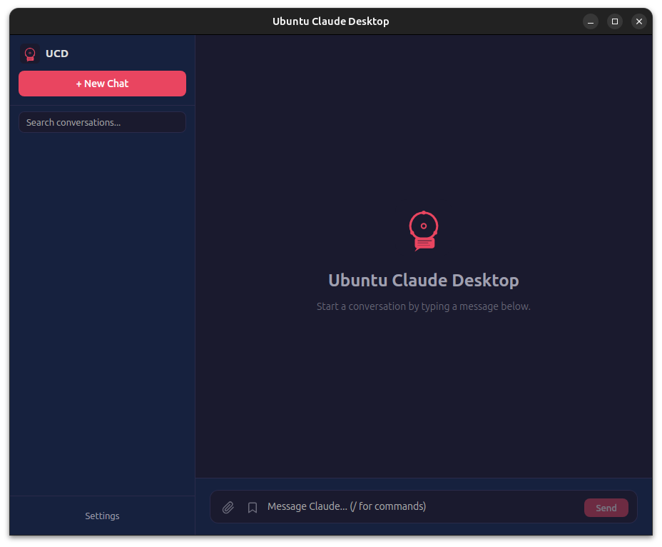
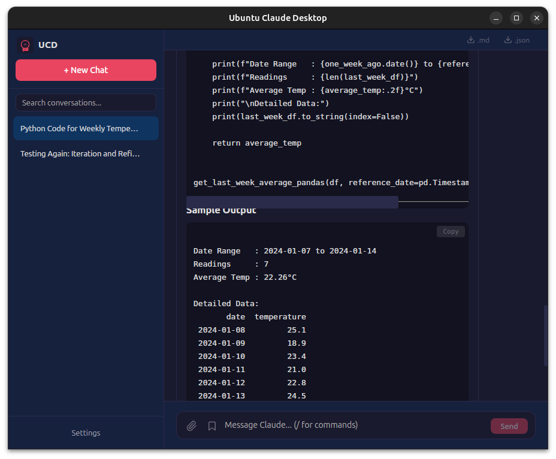
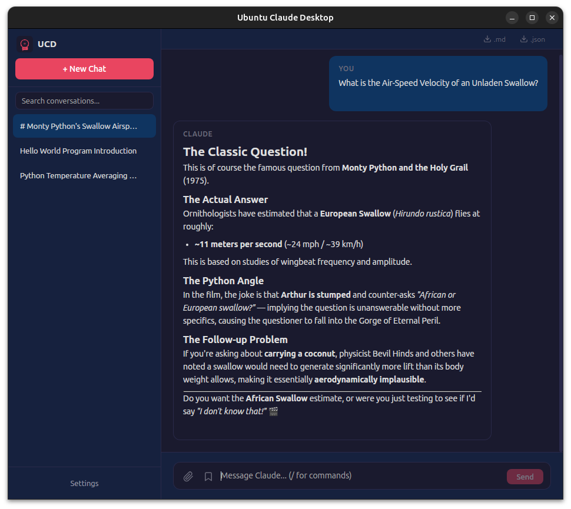
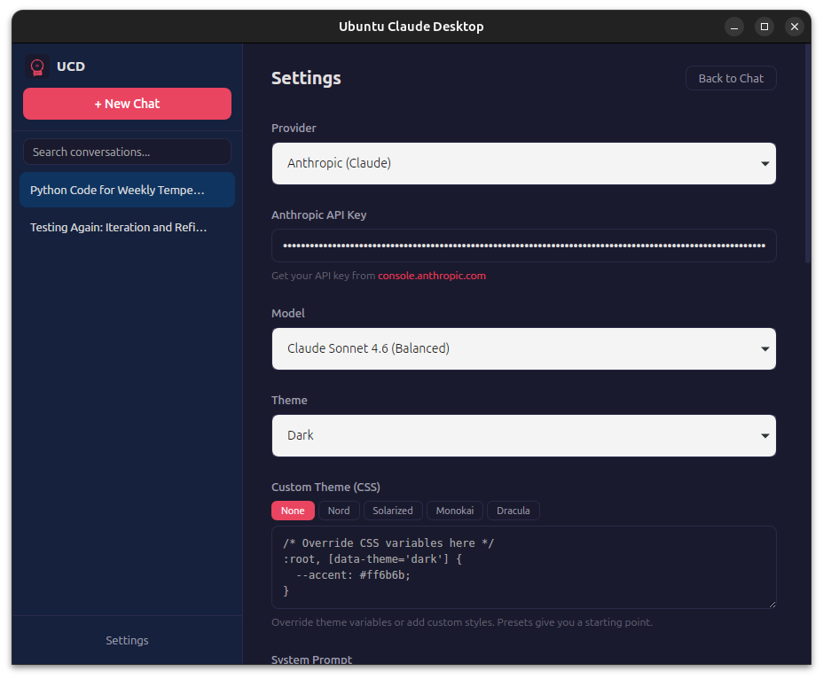
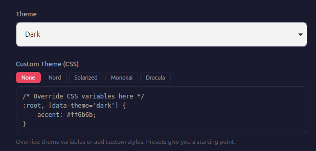

<p align="center">
  
</p>

<h1 align="center">Ubuntu Claude Desktop</h1>

<p align="center">
  A lightweight, native Claude AI desktop client for Ubuntu/Linux built with Tauri v2 and Svelte 5.
</p>

<p align="center">
  
  
  
  
</p>

---

## Screenshots

<p align="center">
  
</p>
<p align="center"><em>Clean welcome screen with quick-start instructions</em></p>

<p align="center">
  
</p>
<p align="center"><em>Streaming chat with syntax-highlighted code blocks</em></p>

<p align="center">
  
</p>
<p align="center"><em>Conversation history with search and management</em></p>

<p align="center">
  
</p>
<p align="center"><em>Multi-provider settings — Anthropic, OpenAI, or Ollama</em></p>

<p align="center">
  
</p>
<p align="center"><em>Custom CSS themes with built-in presets</em></p>

---

## Why?

Anthropic's official Claude Desktop app is available for macOS and Windows, but not Linux. Ubuntu Claude Desktop fills that gap with a native, lightweight alternative that uses the Anthropic API directly.

- **~10MB** binary (vs ~150MB for Electron-based alternatives)
- **Native WebKitGTK** rendering (no bundled Chromium)
- **Low memory footprint** thanks to Tauri's Rust backend
- **Your API key, your data** — everything stays local on your machine

## Features

- Streaming chat responses in real-time
- Conversation management (create, rename, delete)
- Persistent conversation history (SQLite)
- Multi-provider: Anthropic (Claude), OpenAI, Ollama (local models)
- Model selection per provider
- Markdown rendering with syntax-highlighted code blocks
- Copy button on code blocks
- AI-generated conversation titles
- Search/filter conversations
- Custom system prompts
- Image upload with Claude Vision API
- Edit messages and regenerate responses
- Light and dark theme
- System tray integration (minimize to tray)
- LaTeX/math rendering (KaTeX)
- Keyboard shortcuts (Ctrl+N, Ctrl+K, Ctrl+,, Ctrl+L)
- Stop generation mid-stream
- Local API key storage
- Custom CSS themes with presets (Nord, Solarized, Monokai, Dracula)
- Prompt library for reusable templates
- Custom slash commands (run shell scripts from chat)
- Artifacts (sandboxed HTML/SVG preview)
- MCP (Model Context Protocol) tool use
- Project folders with persistent context
- Export conversations (Markdown/JSON)
- Auto-update notifications

## Prerequisites

- **Node.js** >= 18
- **Rust** (install via [rustup](https://rustup.rs/))
- **System libraries:**

```bash
sudo apt install -y libwebkit2gtk-4.1-dev libgtk-3-dev libayatana-appindicator3-dev libssl-dev
```

## Getting Started

```bash
# Clone the repo
git clone https://github.com/ponack/ubuntu-claude-desktop.git
cd ubuntu-claude-desktop

# Install dependencies
npm install

# Run in development mode (first build takes a few minutes)
source "$HOME/.cargo/env"  # if Rust was just installed
npm run tauri dev
```

On first launch:
1. Click **Settings** in the sidebar
2. Choose your **Provider** (Anthropic, OpenAI, or Ollama)
3. Enter your API key (or set Ollama URL for local models)
4. Choose your preferred model
5. Save, and start chatting

## Install (Pre-built)

Download the latest `.deb` from [Releases](https://github.com/ponack/ubuntu-claude-desktop/releases) and install:

```bash
sudo dpkg -i ubuntu-claude-desktop_*.deb
```

## Building from Source

```bash
npm run tauri build
```

This generates a `.deb` package in `src-tauri/target/release/bundle/deb/` that you can install with `dpkg -i`.

## Project Structure

```
ubuntu-claude-desktop/
├── src/                          # Svelte 5 frontend
│   ├── App.svelte                # Layout: sidebar + main area
│   ├── lib/
│   │   ├── Sidebar.svelte        # Conversation list
│   │   ├── Chat.svelte           # Message list + input + streaming
│   │   ├── MessageBubble.svelte  # Markdown rendering per message
│   │   ├── ArtifactPreview.svelte # Sandboxed HTML/SVG preview
│   │   └── Settings.svelte       # Provider, model, themes, plugins config
│   └── styles/global.css         # Light/dark theme CSS variables
├── src-tauri/                    # Rust backend (Tauri v2)
│   └── src/
│       ├── lib.rs                # App state + command registration
│       ├── api.rs                # Multi-provider API streaming (SSE)
│       ├── providers.rs          # Provider types + Ollama model discovery
│       ├── mcp.rs                # Model Context Protocol client
│       └── db.rs                 # SQLite: conversations, messages, settings
└── assets/                       # Logo and branding
```

## Roadmap

### Phase 1 — Polish ✅
- [x] Copy button on code blocks
- [x] Syntax highlighting for code
- [x] AI-generated conversation titles
- [x] Search conversations
- [x] Custom system prompts
- [x] Keyboard shortcuts

### Phase 2 — Feature Parity ✅
- [x] File and image upload (vision API)
- [x] Edit and regenerate messages
- [x] Light/dark theme toggle
- [x] System tray integration
- [x] LaTeX/math rendering

### Phase 3 — Power Features ✅
- [x] Artifacts (sandboxed HTML/SVG preview)
- [x] MCP (Model Context Protocol) support
- [x] Project folders with persistent context
- [x] Export conversations (Markdown/JSON)
- [x] Auto-update mechanism

### Phase 4 — Beyond Official ✅
- [x] Local model support (Ollama)
- [x] Multi-provider support (OpenAI, any OpenAI-compatible API)
- [x] Custom commands / plugin system (slash commands run shell scripts)
- [x] Custom CSS themes with presets (Nord, Solarized, Monokai, Dracula)
- [x] Prompt library/templates

### Phase 4.5 — Polish Pass ✅
- [x] Accessibility (aria-labels, aria-live regions, focus management)
- [x] Active model indicator in chat header
- [x] Settings validation (API keys, URLs)
- [x] Error handling improvements (retry failed sends, surface command errors)
- [x] Preserve partial content on streaming errors
- [x] Professional auto-update system (configurable intervals, download progress, pkexec install, restart)
- [x] About section (version, OS distro, architecture, repo link)

### Phase 5 — Desktop Integration ✅
- [x] Global hotkey to summon app (Super+Shift+C)
- [x] Screenshot-to-Claude (capture region, send via vision API)
- [x] Drag-and-drop file attachments
- [x] Clipboard-aware paste (images)
- [x] Desktop notifications for completed responses
- [x] URI protocol handler (claude://ask?q=...)
- [x] Quick-ask floating overlay window (Super+Shift+Q)
- [x] DBus interface for scripting/automation

### Phase 6 — Workflows & Productivity ✅
- [x] Conversation branching (fork at any message)
- [x] Prompt library/templates with variable placeholders
- [x] Command palette (Ctrl+P)
- [x] Agent mode (multi-step autonomous task execution)
- [x] Scheduled/recurring prompts
- [x] Workspace profiles (per-project API keys, models, prompts)
- [x] Conversation analytics and token usage tracking
- [x] Multi-window support

### Phase 7 — Scale & Reliability ✅
- [x] Conversation pagination / virtual scroll
- [x] Database backup and restore
- [x] Performance profiling and optimization
- [x] Offline mode (queue messages when disconnected)

### Phase 8 — Co-Work (Artifacts) ✅
- [x] Persistent artifacts panel (side panel alongside chat)
- [x] Artifact types (Code, Markdown, Mermaid diagrams, HTML/SVG, React components)
- [x] Live editing with syntax highlighting (CodeMirror 6)
- [x] Iterate with Claude (send artifact state back for modification)
- [x] Multiple artifacts per conversation (tab-based management)
- [x] Artifact versioning (diff between versions, revert)
- [x] Artifact persistence (save to DB, restore on reopen)
- [x] Export artifacts (save to file, clipboard, open in external editor)
- [x] Code splitting (CodeMirror, KaTeX, highlight.js, Mermaid in separate lazy chunks)

### Phase 8.5 — Housekeeping
- [ ] Reduce highlight.js bundle (import only common languages instead of all)
- [ ] Lazy-load Mermaid renderer only when mermaid artifacts are opened
- [ ] Add artifact search/filter in the panel
- [ ] Keyboard shortcuts for artifact panel (Ctrl+E edit, Ctrl+S save, etc.)
- [ ] Artifact templates (starter code for common patterns)

### Phase 9 — Knowledge & Context
- [ ] Local knowledge base (index local files/folders for RAG context)
- [ ] File watcher (auto-update context when watched files change)
- [ ] Web page import (fetch and summarize URLs as context)
- [ ] Conversation memory (persistent facts Claude remembers across conversations)
- [ ] Context window visualization (show token budget usage in real-time)

### Phase 10 — Multi-Model & Comparison
- [ ] Side-by-side model comparison (same prompt to multiple models)
- [ ] Model routing rules (auto-select model based on task type)
- [ ] Response grading/ranking (rate responses to track model quality)
- [ ] Custom model endpoints (add arbitrary OpenAI-compatible providers)
- [ ] Cost estimation per conversation (based on model pricing)

### Phase 11 — Voice & Accessibility
- [ ] Speech-to-text input (system mic via PipeWire/PulseAudio)
- [ ] Text-to-speech output for responses
- [ ] Screen reader support (ARIA landmarks, live regions)
- [ ] High contrast and large text themes
- [ ] Full keyboard-only navigation audit

### Phase 12 — Terminal & Developer Tools
- [ ] Embedded terminal panel (run commands Claude suggests)
- [ ] Code execution sandbox (run Python/JS snippets in artifacts)
- [ ] Git integration (view diffs, stage changes, commit from chat)
- [ ] Project scaffolding (generate project structures from descriptions)
- [ ] LSP integration (type checking and linting in artifact editor)

### Phase 13 — Plugin System
- [ ] Plugin API (JavaScript/TypeScript plugin interface)
- [ ] Plugin marketplace / registry
- [ ] Custom renderers via plugins (extend artifact types)
- [ ] Custom commands via plugins (beyond shell commands)
- [ ] Event hooks (on-message, on-response, on-artifact-create)

## Tech Stack

| Layer | Technology |
|-------|-----------|
| Framework | [Tauri v2](https://v2.tauri.app/) |
| Frontend | [Svelte 5](https://svelte.dev/) |
| Backend | Rust |
| Database | SQLite (via rusqlite) |
| API | [Anthropic](https://docs.anthropic.com/en/api/messages), [OpenAI](https://platform.openai.com/docs/api-reference), [Ollama](https://ollama.com/) |
| Build | Vite |

## Contributing

Contributions are welcome! Feel free to open issues or submit pull requests.

## License

MIT

## Disclaimer

This is an unofficial, community-built client. It is not affiliated with or endorsed by Anthropic. "Claude" is a trademark of Anthropic.
